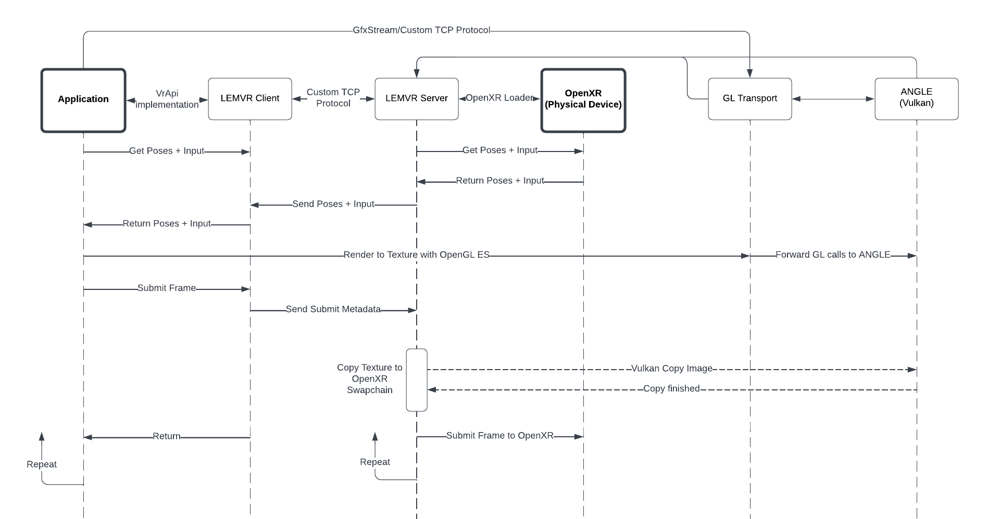

# LEMVR
LEMVR (pronounced "lemur") is an in-development compatibility layer that will allow apps built for the Meta Quest to be used on PCVR systems. It is functionally equivalent to a Quest emulator for PC, but doesn't emulate the entire Quest operating system in the traditional sense of an emulator. Instead, it runs in an Android virtual machine on top of a native bridge like libhoudini or [Intel's Native Bridge](https://www.androidcentral.com/what-intel-bridge-technology-and-how-does-it-get-android-apps-working-windows-11). For graphics, it uses Google's [ANGLE](https://github.com/google/angle) to translate OpenGL ES calls made by the applications into Vulkan commands run on the host. To interface with the PCVR headset, it uses [OpenXR](https://www.khronos.org/openxr/). To summarize, it is effectively a bridge between the Oculus Mobile SDK and OpenXR (PCVR).

## Components
This project consists of several components used to simulate the environment of an actual Quest. Some are external libraries, and others are used to interface between components.

External Components:
- **OpenXR**: used to interface with PCVR headsets in a platform-agnostic way.
- **ANGLE**: used to translate the OpenGL ES calls made by the application into an API that the host PC can use (Vulkan).
- **Native Bridge**: allows Quest apps compiled for ARM to be executed in an x86 virtual machine.
- **Application**: the actual Quest application.

Internal Components:
- **LEMVR Client**: implements the Oculus VrApi that Quest apps are built against. Communicates with the server via custom TCP protocol to provide poses and input to the application.
- **LEMVR Server**: interfaces with OpenXR to get poses and input and control the client.
- **GL Transport**: consists of a client and a server. The client serializes OpenGL ES calls and sends them over TCP to the server. The server executes them via ANGLE and sends back any results.

## Frame Loop
To better understand how LEMVR works, here is a high level diagram of what happens every frame:

## Showcase
Here is a showcase of a (very simple) Quest application running on the LEMVR stack with a simulated headset:

https://user-images.githubusercontent.com/23425724/171983737-5c88a66c-2086-4719-8e72-d717bb6d79aa.mp4

Note: as this project is incomplete, this is not using every component described above. This demo was created on an actual Android device by using a LEMVR client that was modified to display its images on screen, and a LEMVR server that doesn't (yet) interface with OpenXR and just provides oscillating positions.

## See Also
- [lemvr_protocol.md](lemvr_protocol.md) - Protocol used between LEMVR Client and LEMVR Server
- [GLoIP](https://github.com/AndrewSumsion/GLoIP) - Initial work on a GL Transport layer

## Disclaimer
I am not publishing the source of the project yet. When it's more mature and when I'm sure it's legally sound, I plan to publish this project under an open-source license.
